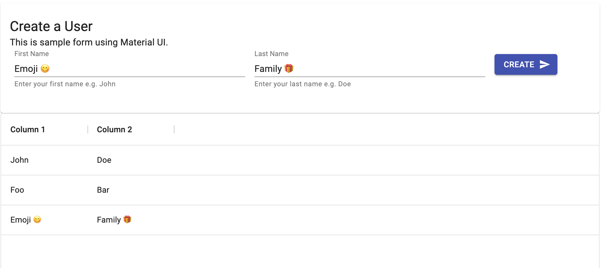

[](https://datalayer.io)

# Crossplane Examples

> 🚧 This is WIP

This repository showcases different usecase for [Crossplane](https://crossplane.io) on top of [Google Cloud](https://cloud.google.com).

See also the companion blog post [Crossplane by example](https://blog.datalayer.io/2021/05/16/crossplane-by-example).

> Ensure you have credits on GCloud to run these examples.

<div style="max-width: 300px">
  
</div>

This repository aims to complement the official [Crossplane documentation](https://crossplane.io/docs) to give step by step examples to deploy infrastruture and services on [Google Cloud](https://cloud.google.com) and can be applied to other clouds like [Amazon](https://aws.amazon.com), [Azure](https://azure.microsoft.com)...

We have a first section with a standard flow like settting-up the environment, deploying managed and composite resources as helm chart...

We also have a second section where we build our own application, a React.js user interface interacting with managed resources. You are expected to following from Step 1 to the end. If you jump directly to a specific Step, ensure your enviornement, including the shell environment variables, are set as expected.

## Standard Flows

Step 1: [Create GCloud Project](./docs/01-gcloud-project.md).

Step 2: [Create a Control Cluster](./docs/02-control-cluster.md).

Step 3: [GCP Provider on the Control cluster.](./docs/03-gcp-provider.md)

Step 4: [Create managed resources](./docs/04-managed.md).

Step 5: [Deploy Helm releases](./docs/05-helm.md).

Step 6: [Deploy a Reference Platform](./docs/07-ref-platform.md).

Step 7: [Deploy a Configuration](./docs/06-configuration.md).

Step 8: [Deploy a Wordpress Cluster](./docs/08-wordpress-cluster.md).

Step 9: [Destroy](./docs/09-destroy.md).

[Troubleshoot](./docs/10-troubleshoot.md) (hopefully not too much).

## Example Web User Interface

The UI allows you to insert and view a list of simple records from a Postgresql database deployed on GCP.



> TODO Better documentation, for now, it is not understandable by a new-comer...

```bash
psql -c "DELETE FROM USERS;" -d crossplane_examples
echo """DB_HOST=localhost
DB_PORT=5432
DB_USERNAME=datalayer
DB_PASSWORD=datalayer""" > .env
source .env
```

```bash
make docker-build
make docker-push
make helm-deploy
make crossplane-apply
make crossplane-status
```

```bash
export DB_ENDPOINT=$(kubectl get secret crossplane-example-role-secret -n crossplane-examples -o jsonpath='{.data.endpoint}' | base64 --decode)
export DB_USERNAME=$(kubectl get secret crossplane-example-role-secret -n crossplane-examples -o jsonpath='{.data.username}' | base64 --decode)
export DB_PASSWORD=$(kubectl get secret crossplane-example-role-secret -n crossplane-examples -o jsonpath='{.data.password}' | base64 --decode)
PGPASSWORD=$DB_PASSWORD psql "dbname=crossplane_examples user=$DB_USERNAME hostaddr=$DB_ENDPOINT"
\l
\q
```
